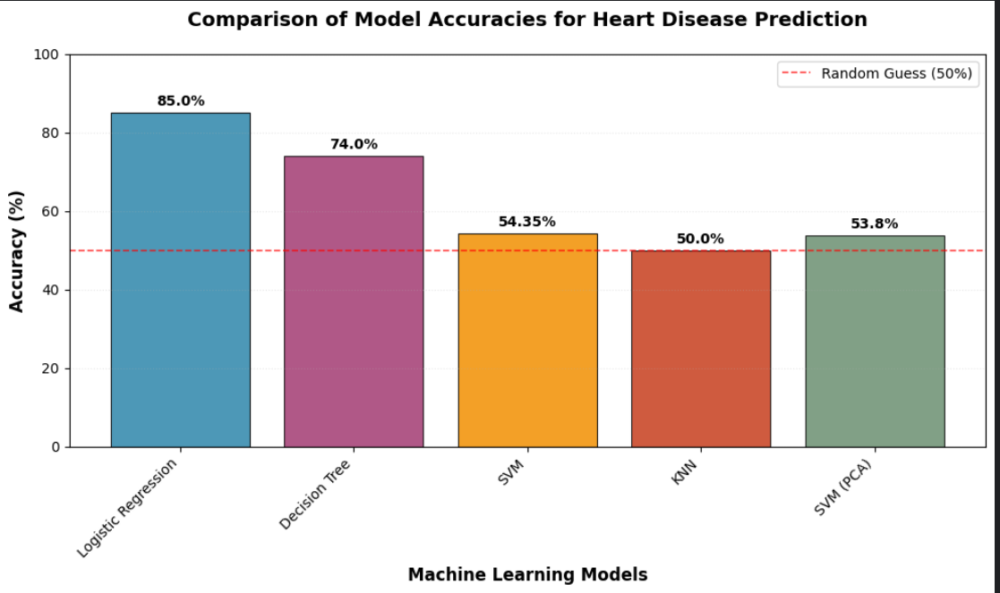

# Comparison of Machine Learning Algorithms for Heart Disease Prediction

  

## 📖 Overview
This project presents a comprehensive comparison of various machine learning algorithms applied to the Heart Failure Prediction dataset. The goal is to evaluate and compare the performance of models like Logistic Regression, Decision Trees, SVM, KNN, and ensemble methods in predicting the presence of heart disease.

## 📊 Results Summary
| Model | Accuracy | Precision | Recall | F1-Score |
| :--- | :---: | :---: | :---: | :---: |
| Logistic Regression | **85.0%** | ... | ... | ... |
| Decision Tree | 74.0% | ... | ... | ... |
| Support Vector Machine (SVM) | 54.35% | ... | ... | ... |
| K-Nearest Neighbors (KNN) | 50.0% | ... | ... | ... |



## 🗂️ Project Structure
```
heart-disease-prediction-ml-comparison/
├── heart_disease_ml_comparison.ipynb  # Main Jupyter Notebook
├── heart.csv                          # Dataset
├── requirements.txt                   # Python dependencies
├── README.md                          # This file
└── images/                            # Directory for plots and graphs
    └── accuracy_plot.png
```

## 🚀 Installation & Usage

1.  **Clone the repository:**
    ```bash
    git clone https://github.com/disha-katkade/Comparison-of-ML-Algos-on-Heart-Failure-Prediction.git
    cd Comparison-of-ML-Algos-on-Heart-Failure-Prediction
    ```

2.  **Create a virtual environment (recommended):**
    ```bash
    python -m venv venv
    source venv/bin/activate  # On Windows: venv\Scripts\activate
    ```

3.  **Install dependencies:**
    ```bash
    pip install -r requirements.txt
    ```

4.  **Run the Jupyter Notebook:**
    ```bash
    jupyter notebook comparison-of-machine-learning-algorithms.ipynb
    ```

## 🔬 Methodology
1.  **Data Preprocessing:** Handled missing values, performed one-hot encoding on categorical variables, and scaled numerical features.
2.  **Model Training:** Trained and evaluated multiple classifiers using an 80-20 stratified train-test split.
3.  **Evaluation:** Models were compared based on Accuracy, Precision, Recall, and F1-Score.

## 📝 Key Findings
- Logistic Regression achieved the highest accuracy (**85%**), establishing a strong baseline.
- Distance-based models (SVM, KNN) performed poorly, suggesting feature scaling or engineering could be improved.
- The results highlight the importance of choosing the right model for the specific data structure.

## 👨‍💻 Author
**Disha Katkade**
- [](https://www.kaggle.com/diissha)
- [](https://www.linkedin.com/in/disha-0a6781344/)


## 📜 License
This project is licensed under the MIT License - see the [LICENSE](LICENSE) file for details.

## 🙏 Acknowledgments
- Data source: [Heart Failure Prediction Dataset on Kaggle](https://www.kaggle.com/datasets/fedesoriano/heart-failure-prediction)
